# Authentik and Traefik  

## Overview  
This guide assumes that there is a working Traefik v2.7+ running and that the Traefik network is called _traefik_.  I will also be using the embedded outpost instead of a standalone proxy outpost container.  

Additionally, I am NOT allowing Authentik to view the Docker socket and auto create providers.  

Lastly, @deathnmind (https://github.com/deathnmind) and I wrote this for `mkdocs`.  That means the `???+` you see thorughout this document are meant to be collapsible admonitions (https://squidfunk.github.io/mkdocs-material/reference/admonitions/#collapsible-blocks).  I'll look at making this something nicer for GitHub soon.  

## DNS Record  
Ensure that a DNS record exists for `authentik.domain.tld` as the compose and all material here assumes that will be the record name.  

## Docker Compose setup for Authentik  
Authentik's developer has an initial docker compose setup guide and `docker-compose.yml` located at:  

???+ info "authentik.io"   
    https://goauthentik.io/docs/installation/docker-compose   
    https://goauthentik.io/docker-compose.yml   

In order for the forwardAuth to make sense, I've modified the provided docker-compose.yml and added the appropriate Traefik labels.  I am also using docker secrets in order to protect sensitive information.  

???+ info 
    I am using "fake" docker secrets and binding them into the compose instead of saving sensitive data in environment variables.  You can remove the secrets section and work with regular environment variables if that makes more sense for your environment.  This is strictly a working example, hopefully with enough documentation to help anyone else that might be stuck.  


First create an environment variable file `.env` in the same directory as the `docker-compose.yml` with the following information, ensuring to update everywhere that has a **CHANGEME** to match your environment. If you want, these values can all be manually coded into the `docker-compose.yml` instead of having a separate file.  

```bash title=".env" hl_lines="2 3 4 6 36 44 50 51"  
# .env (in ALL)  
DOCKERDIR=/ssd/compose  # CHANGEME
PUID=1100               # CHANGEME
PGID=1100               # CHANGEME
TZ=America/New_York
DOMAIN=CHANGEME.net     # CHANGEME


################################################################  
# PostgreSQL
################################################################  
POSTGRES_DB=/run/secrets/authentik_postgresql_db
POSTGRES_USER=/run/secrets/authentik_postgresql_user
POSTGRES_PASSWORD=/run/secrets/authentik_postgresql_password


################################################################  
# Authentik
################################################################  
AUTHENTIK_REDIS__HOST=redis

AUTHENTIK_POSTGRESQL__HOST=postgresql
AUTHENTIK_POSTGRESQL__NAME=$POSTGRES_DB
AUTHENTIK_POSTGRESQL__USER=$POSTGRES_USER
AUTHENTIK_POSTGRESQL__PASSWORD=$POSTGRES_PASSWORD

AUTHENTIK_ERROR_REPORTING__ENABLED: "false"
AUTHENTIK_SECRET_KEY=/run/secrets/authentik_secret_key
AUTHENTIK_COOKIE_DOMAIN=$DOMAIN
# WORKERS=2

# SMTP Host Emails are sent to
AUTHENTIK_EMAIL__HOST=smtp.gmail.com
AUTHENTIK_EMAIL__PORT=587
# Optionally authenticate (don't add quotation marks to your password)
AUTHENTIK_EMAIL__USERNAME=CHANGEME@gmail.com
AUTHENTIK_EMAIL__PASSWORD=/run/secrets/authelia_notifier_smtp_password
# Use StartTLS
AUTHENTIK_EMAIL__USE_TLS=false
# Use SSL
AUTHENTIK_EMAIL__USE_SSL=false
AUTHENTIK_EMAIL__TIMEOUT=10
# Email address authentik will send from, should have a correct @domain
AUTHENTIK_EMAIL__FROM=CHANGEME@gmail.com


################################################################  
# GeoIP
################################################################  
GEOIPUPDATE_ACCOUNT_ID=CHANGEME
GEOIPUPDATE_LICENSE_KEY=CHANGEME
AUTHENTIK_AUTHENTIK__GEOIP=/geoip/GeoLite2-City.mmdb
GEOIPUPDATE_EDITION_IDS=GeoLite2-City
GEOIPUPDATE_FREQUENCY=8
```


```yaml title="docker-compose.yml"  
version: "3.9"

###############################################################
# Services
###############################################################
services:

  postgresql:
    image: postgres:12-alpine
    container_name: authentik_postgres
    restart: unless-stopped
    healthcheck:
      test: ["CMD-SHELL", "pg_isready -d $${POSTGRES_DB} -U $${POSTGRES_USER}"]
      start_period: 20s
      interval: 30s
      retries: 5
      timeout: 5s
    networks:
      - traefik
    volumes:
      - "$DOCKERDIR/apps/authentik/postgresql/data:/var/lib/postgresql/data"
    environment:
      - POSTGRES_DB
      - POSTGRES_USER
      - POSTGRES_PASSWORD
    secrets:
      - authentik_postgresql_db
      - authentik_postgresql_user
      - authentik_postgresql_password


  redis:
    image: redis:alpine
    container_name: authentik_redis
    restart: unless-stopped
    healthcheck:
      test: ["CMD-SHELL", "redis-cli ping | grep PONG"]
      start_period: 20s
      interval: 30s
      retries: 5
      timeout: 3s
    networks:
      - traefik


  # Use the embedded outpost (2021.8.1+) instead of the seperate Forward Auth / Proxy Provider container
  authentik_server:
    image: ghcr.io/goauthentik/server:latest
    container_name: authentik_server
    restart: unless-stopped
    command: server
    networks:
      - traefik
    volumes:
      - "$DOCKERDIR/apps/authentik/media:/media"
      - "$DOCKERDIR/apps/authentik/custom-templates:/templates"
      - "$DOCKERDIR/apps/authentik/geoip/data:/geoip"
    environment:
      - AUTHENTIK_REDIS__HOST
      - AUTHENTIK_POSTGRESQL__HOST
      - AUTHENTIK_POSTGRESQL__NAME
      - AUTHENTIK_POSTGRESQL__USER
      - AUTHENTIK_POSTGRESQL__PASSWORD
      - AUTHENTIK_EMAIL__PASSWORD
      - AUTHENTIK_ERROR_REPORTING__ENABLED
      - AUTHENTIK_SECRET_KEY
      - AUTHENTIK_COOKIE_DOMAIN
      # - WORKERS
    secrets:
      - authentik_postgresql_db
      - authentik_postgresql_user
      - authentik_postgresql_password
      - authelia_notifier_smtp_password
      - authentik_secret_key
    labels:
      - "traefik.enable=true"
      ## HTTP Routers
      - "traefik.http.routers.authentik-rtr.rule=Host(`authentik.$DOMAIN`)"
      - "traefik.http.routers.authentik-rtr.entrypoints=websecure"
      - "traefik.http.routers.authentik-rtr.tls=true"
      - "traefik.http.routers.authentik-rtr.tls.certresolver=le"
      ## Individual Application forwardAuth regex (catch any subdomain using individual application forwardAuth)  
      - "traefik.http.routers.authentik-rtr-outpost.rule=HostRegexp(`{subdomain:[a-z0-9-]+}.$DOMAIN`) && PathPrefix(`/outpost.goauthentik.io/`)"
      - "traefik.http.routers.authentik-rtr-outpost.entrypoints=websecure"
      - "traefik.http.routers.authentik-rtr-outpost.tls=true"
      - "traefik.http.routers.authentik-rtr-outpost.tls.certresolver=le"
      ## HTTP Services
      - "traefik.http.routers.authentik-rtr.service=authentik-svc"
      - "traefik.http.services.authentik-svc.loadBalancer.server.port=9000"
      ## Watchtower
      - "com.centurylinklabs.watchtower.enable=true"


  authentik_worker:
    image: ghcr.io/goauthentik/server:latest
    container_name: authentik_worker
    restart: unless-stopped
    command: worker
    networks:
      - traefik
    volumes:
      - "$DOCKERDIR/apps/authentik/media:/media"
      - "$DOCKERDIR/apps/traefik/cert_export:/certs:ro"
      - "$DOCKERDIR/apps/authentik/custom-templates:/templates"
      - "$DOCKERDIR/apps/authentik/geoip/data:/geoip"
    environment:
      - AUTHENTIK_REDIS__HOST
      - AUTHENTIK_POSTGRESQL__HOST
      - AUTHENTIK_POSTGRESQL__NAME
      - AUTHENTIK_POSTGRESQL__USER
      - AUTHENTIK_POSTGRESQL__PASSWORD
      - AUTHENTIK_EMAIL__PASSWORD
      - AUTHENTIK_ERROR_REPORTING__ENABLED
      - AUTHENTIK_SECRET_KEY
      - AUTHENTIK_COOKIE_DOMAIN
    secrets:
      - authentik_postgresql_db
      - authentik_postgresql_user
      - authentik_postgresql_password
      - authelia_notifier_smtp_password
      - authentik_secret_key
    

  geoipupdate:
    image: maxmindinc/geoipupdate:latest
    container_name: geoipupdate
    restart: unless-stopped
    volumes:
      - "$DOCKERDIR/apps/authentik/geoip/data:/usr/share/GeoIP"
    environment:
      - GEOIPUPDATE_EDITION_IDS
      - GEOIPUPDATE_FREQUENCY
      - GEOIPUPDATE_ACCOUNT_ID
      - GEOIPUPDATE_LICENSE_KEY


  whoami-test:
    image: traefik/whoami
    container_name: whoami-test
    restart: unless-stopped
    security_opt:
      - no-new-privileges:true
    networks:
      - traefik
    environment:
      - TZ
    labels:
      - "traefik.enable=true"
      ## HTTP Routers
      - "traefik.http.routers.whoami-test-rtr.rule=Host(`whoami-test.$DOMAIN`)"
      - "traefik.http.routers.whoami-test-rtr.entrypoints=websecure"
      - "traefik.http.routers.whoami-test-rtr.tls=true"
      - "traefik.http.routers.whoami-test-rtr.tls.certresolver=le"
      ## Middlewares
      - "traefik.http.routers.whoami-test-rtr.middlewares=middlewares-authentik@file"


###############################################################
# Docker Secrets
###############################################################
secrets:
  # Authentik Postgres
  authentik_postgresql_db:
    file: $DOCKERDIR/secrets/authentik_postgresql_db
  authentik_postgresql_user:
    file: $DOCKERDIR/secrets/authentik_postgresql_user
  authentik_postgresql_password:
    file: $DOCKERDIR/secrets/authentik_postgresql_password
  # Authentik
  authentik_secret_key:
    file: $DOCKERDIR/secrets/authentik_secret_key
  # GMail Auth Account
  authelia_notifier_smtp_password:
    file: $DOCKERDIR/secrets/authelia_notifier_smtp_password


###############################################################
# Networks
###############################################################
networks:
  traefik:
    external: true
```

### Bring the authentik stack online!  

Start up the container stack!  
```docker
docker compose up -d
```


## Traefik Middleware Preperation  
Traefik is already proxying the connections to the Authentik container/service.  Additional middleware rules and an embedded outpost must be configured to enable authentication with Authentik through Traefik, **forwardAuth**.  

In order to setup forwardAuth at a minimum, Traefik requires a declaration.  Authentik provides an example, but in accordance with the `docker-compose.yml` the values below should make more sense.  

???+ info "Authentik Forward Auth"  
    https://goauthentik.io/docs/providers/proxy/forward_auth  

```yaml title="middlewares.yml"
http:
  middlewares:
    # https://github.com/goauthentik/authentik/issues/2366
    middlewares-authentik:
      forwardAuth:
        address: "http://authentik_server:9000/outpost.goauthentik.io/auth/traefik"
        trustForwardHeader: true
        authResponseHeaders:
          - X-authentik-username
          - X-authentik-groups
          - X-authentik-email
          - X-authentik-name
          - X-authentik-uid
          - X-authentik-jwt
          - X-authentik-meta-jwks
          - X-authentik-meta-outpost
          - X-authentik-meta-provider
          - X-authentik-meta-app
          - X-authentik-meta-version
```

???+ warning "Priority based on rule length"
    Authentik generates the priority for authentication based on rule length (Traefik label).  This means if you have a rule (Traefik label) for Authentik to listen on multiple host names with `OR, ||` statements, it will have a higher priority than the embedded outpost.  Refer to <https://github.com/goauthentik/authentik/issues/2180> about setting the priority for the embedded outpost.  

Once the Authentik `middleware.yml` with (at least) the above configuration is saved in the Traefik rules directory, validate that the middleware should be listed as enabled, via Traefik's dashboard.  

* If the middleware is not listed, try `docker-compose up -d --force-recreate` to recreate the containers.  
* The Forward Authentication **WILL NOT** work unless the middleware is enabled.  
* Alternatively a chain of middleware can be used to enforce traefik best practices with the Authentik middleware added to the chain.  

## Authentik Setup  

### Initial Setup  
With Authentik being reverse proxied through Traefik and the middleware showing as enabled in Traefik's dashboard, then configuration of Authentik can begin.  

- Navigate to Authentik at `https://authentik.domain.tld/if/flow/initial-setup/`  
- Login to Authentik to begin setup.  
???+ note "First time setup"  
    If this is the first time logging in you will have to set the password for `akadmin` (default user).  
    **NOTE**: If establishing the default credentials fails - the setup is not working correctly.  

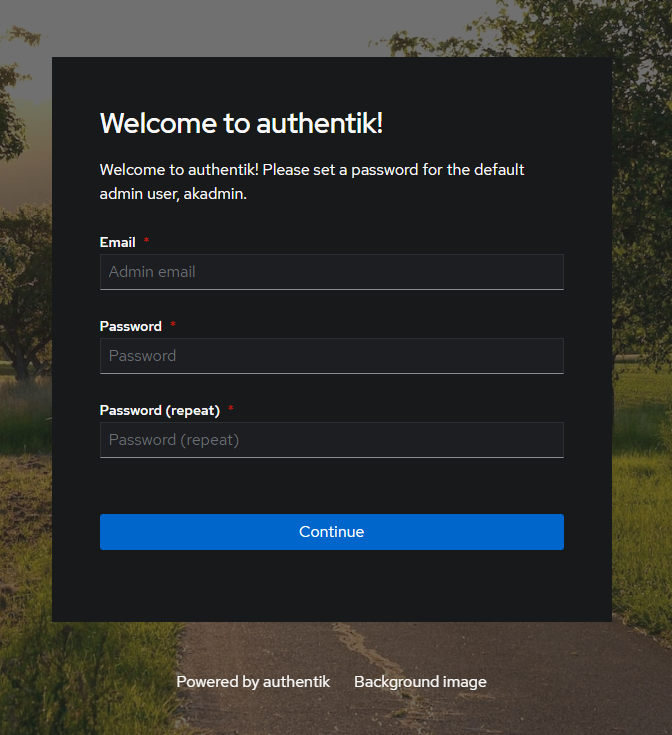  

After successful login to the `akadmin` user to Authentik open the `Admin Interface` clicking the button in the upper right.  

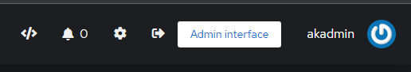  

### (Optional) Change `akadmin` username  
You can change the username from `akadmin` to match whatever email scheme you previously used.  In the Admin Interface go to Directory -> Users and left click on `akadmin`, then go to Edit:  

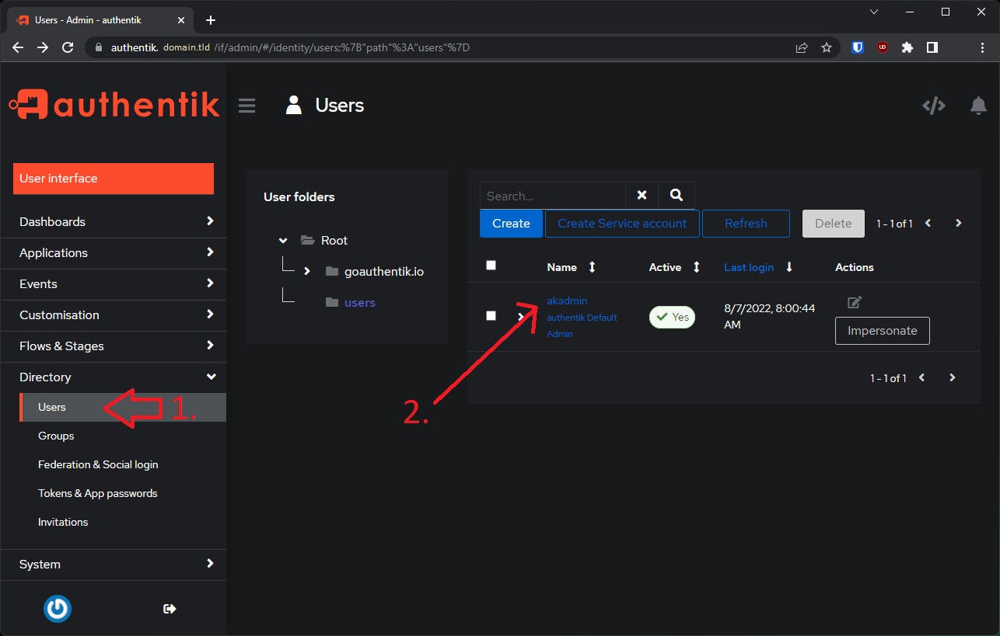  
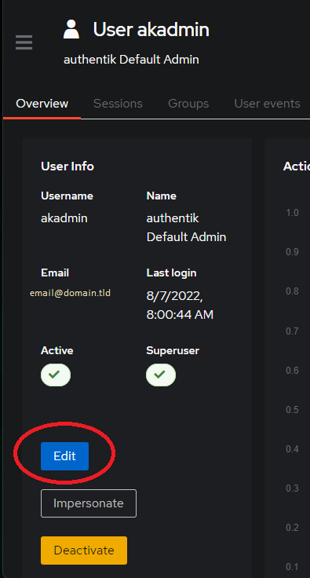  
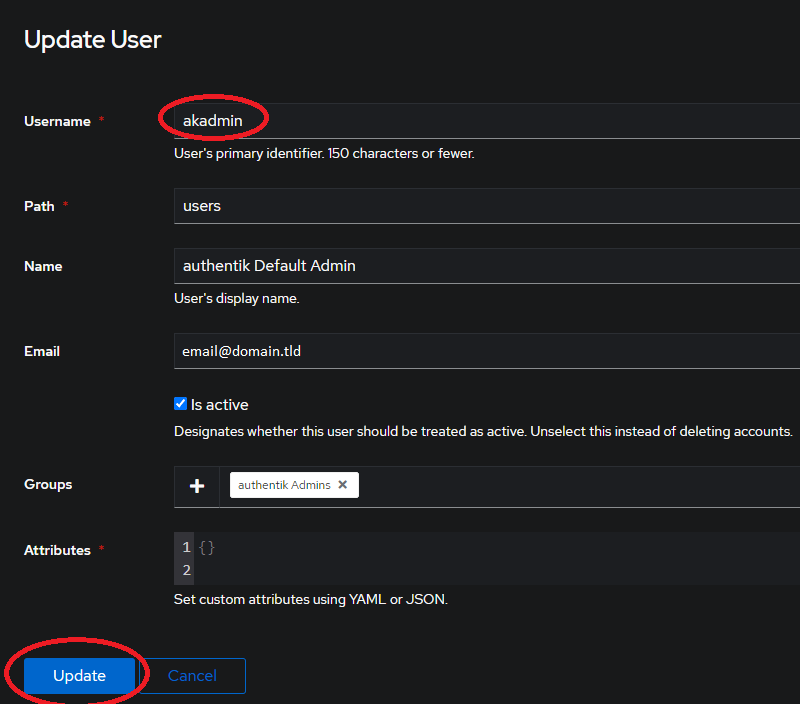  


## Applications / Providers  

This guide is built off of the 2022.07.03 update which includes the embedded outpost.  
The embedded outpost requires version `2021.8.1` or newer.  This prevents needing the seperate Forward Auth / Proxy Provider container.  

### Traefik Domain Wide / Catch All (forwardAuth)  

#### Provider Creation (domain wide)  
1.  In the Admin Interface, go to Applications -> Providers -> Create  
    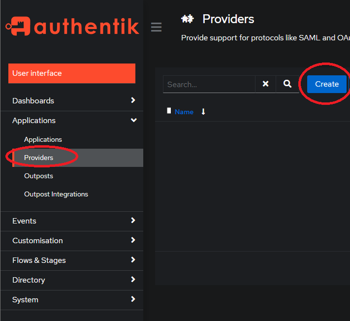  

2.  Proxy Provider
    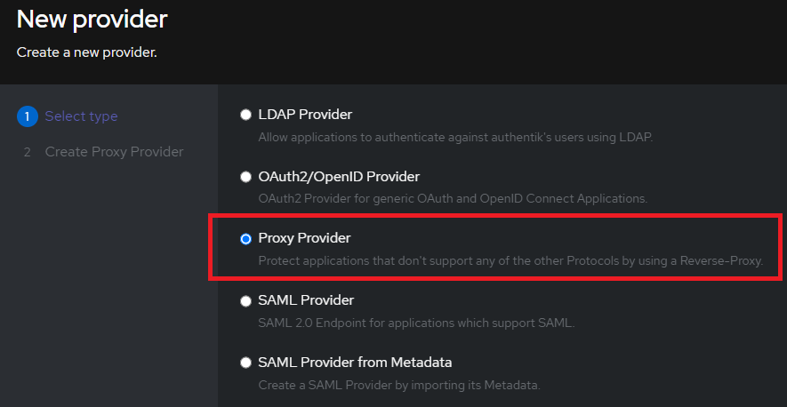  

    a.  Name: `Domain Forward Auth Provider`  
    b.  Select: `Forward auth (domain level)`  
    c.  Authentication URL: `https://authentik.domain.tld`  

    ???+ note "Authentication URL"  
        This URL should be the authentik service URL, which matches the Traefik host rule/label.  

    d.  Cookie domain: `domain.tld`  
    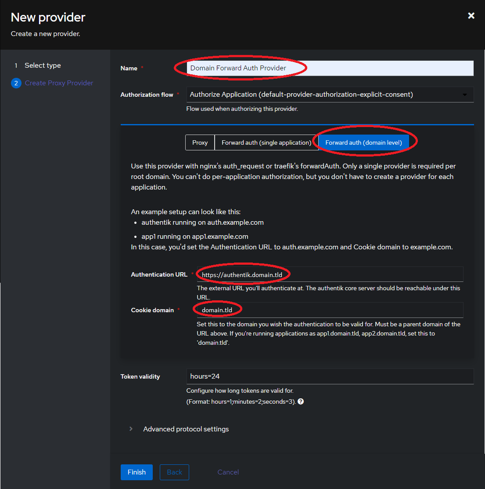  

    After hitting Finish it will show that it's not bound to an Application:  
    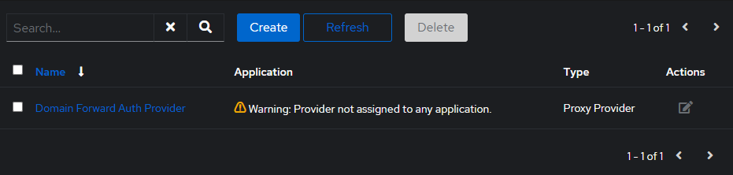  

#### Application Creation (domain wide)  
1.  In the Admin Interface, go to Applications -> Applications -> Create   
    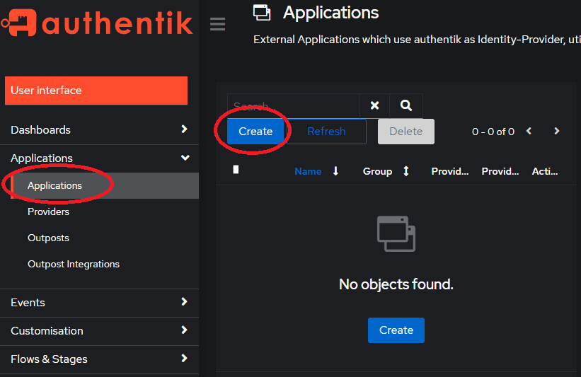  

    a.  Name: `Domain Forward Auth Application`  
        _This is what appears on the Authentik user interface/dashboard_  
    b.  Slug: `domain-forward-auth-application`  
        _An internal application name, name isn't super important_  
    c.  Provider: `Domain Forward Auth Provider`  
        _This should match the previously created provider_  
    d.  Launch URL: `empty`  
        _Do NOT put anything in the Launch URL, it needs to autodetect since it's the catch all rule_  
    e.  UI Settings (additional) - Up to you to decide on any of the remaining optional items.  

    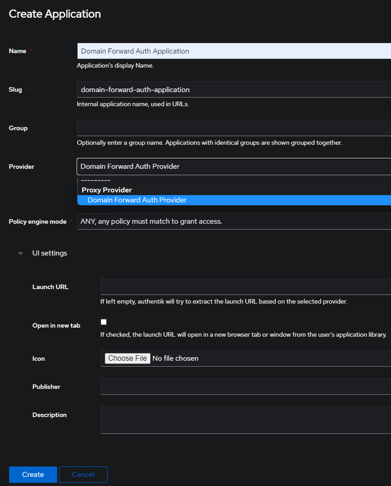  

    After hitting Create it will show that it is now bound to the previously created provider:  
      

#### Embedded Outpost (domain wide)  
1.  In the Admin Interface, go to Applications -> Outposts
2.  Edit the existing embedded outpost by clicking Edit under Actions  
   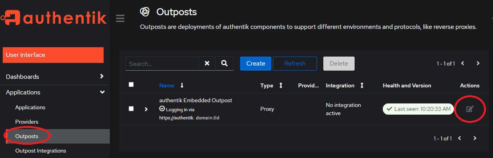  

3.  **Highlight** any application you want the outpost to be able to provide for.  In this case **Highlight** `Domain Forward Auth Application`  

    ***BEFORE HIGHLIGHT***  
    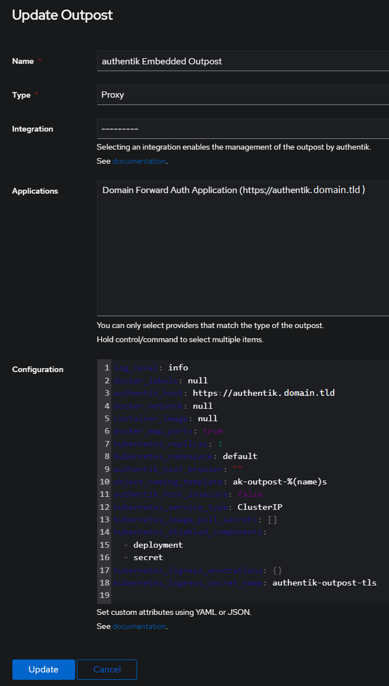  

    ***AFTER HIGHLIGHT***  
    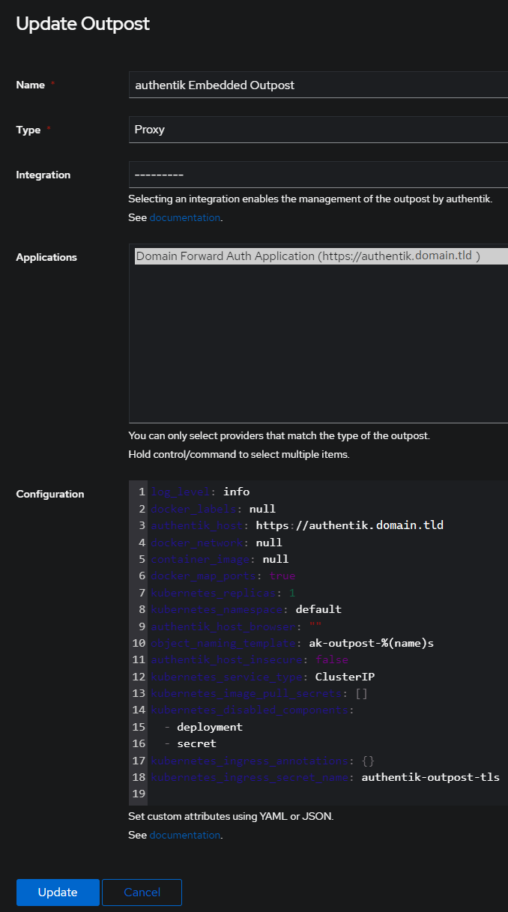  

    After hitting Update the Outpost page will show that the embedded outpost now has a provider bound to it:  
    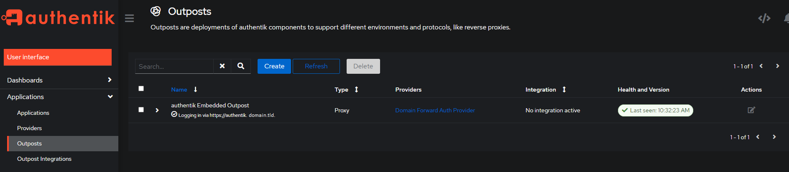  

#### Traefik Domain Wide / Catch All (Test / Validation)  
In order for Traefik to apply forwardAuth and require authentication to access a resource, you must tell Traefik that by adding a Middleware.  

In the above `docker-compose.yml` I have a whoami container for testing.  This container gives you a ton of important information for troubleshooting and debugging.  

```yaml
      ## Middlewares
      - "traefik.http.routers.whoami-test-rtr.middlewares=middlewares-authentik@file"
```

`middlewares-authentik@file` is what was defined at the top of this document in `middlewares.yml`.  

For each container you want protected, ensure you update/add the http router piece of Traefik's label, specifically `whoami-test-rtr` in the example shown above.  

Once this label is added to the container, recreate it.  
```bash
# Example using the whoami-test container  
docker-compose up -d -force-recreate whoami-test  
```

???+ warning "Incognito Browser"  
    Because authentik uses cookies, I recommend using Incognito for each piece of testing, so you don't have to clear cookies every time or when something is setup incorrectly.  
    
    **While using a container behind Authentik, it prompts for authentication, and then flashes but doesn't load.  This generally indicates cookies are messing up  the loading.  So use INCOGNITO**.

Next, navigate to `https://whoami-test.domain.tld`.  You should hit the authentication splash page due to Traefik's middleware.  Notice that the text below gives you a little bit of information that it is being caught by the Catch All rule.    
    

Sign in with your username or email address initially created.  After inputting username & password, it should show you the "Redirecting" screen prior to actual redirection:  
    

After the redirect, look at the whoami information.  Notice it even reflects the domain wide forwardAuth and that it is using the embedded outpost!  
  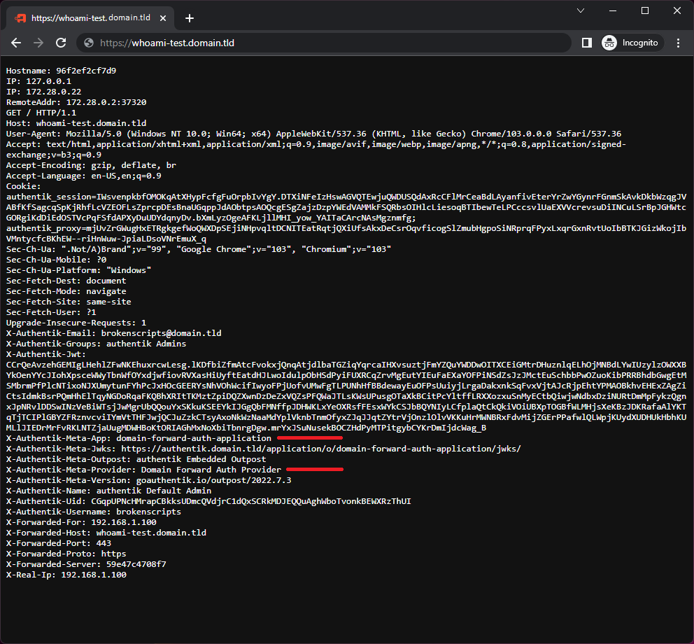  

The `X-Authentik-Meta-App` will contain information about the specific Application used to get here.  Notice that this matches the `slug` previously created.  
```html
X-Authentik-Meta-App: domain-forward-auth-application
```

### Traefik Individual Application (forwardAuth)  
An Application specific Forward Auth configuration will allow different authentication flows to be selected and not disrupt the default domain authentication flow.  For example the default domain authentication flow allows a user to authentication with Authentik using username/password only.  An application specific could be used for app with additional security ie an OTP, or local networks only, etc..  In most cases the default authentication flow will serve most homelab uses.  

**A lot of the steps are similar to the Domain Catch-all configuration with a few changes.**  

---

As of version 2022.07.03 authentik still requires `/outpost.goauthentik.io/` to be routed **IF USING INDIVIDUAL APPLICATIONS INSTEAD OF A SINGLE DOMAIN WIDE CATCH-ALL**.  At the end of July 2022 `BeryJu` has an upcoming fix that should remove the below label.  

> ***Note: This does not seem to be required on everyone's setup.  Individual Application forwardAuth does not work on mine without this label.  I recommend you check your setup both with this label.***  

???+ info "providers/proxy: no exposed urls #3151"
    https://github.com/goauthentik/authentik/pull/3151
    > This PR greatly simplifies the Forward auth setup for traefik and envoy. It'll remove the requirement `/outpost.goauthentik.io` to be openly accessible, which makes setup easier and decreases attack surface.

```bash
      ## Individual Application forwardAuth regex (catch any subdomain using individual application forwardAuth)  
      - "traefik.http.routers.authentik-rtr-outpost.rule=HostRegexp(`{subdomain:[a-z0-9-]+}.$DOMAIN`) && PathPrefix(`/outpost.goauthentik.io/`)"
      - "traefik.http.routers.authentik-rtr-outpost.entrypoints=websecure"
      - "traefik.http.routers.authentik-rtr-outpost.tls=true"
      - "traefik.http.routers.authentik-rtr-outpost.tls.certresolver=le"
```

---

#### Provider Creation (individual application)  
1.  In the Admin Interface, go to Applications -> Providers -> Create  
    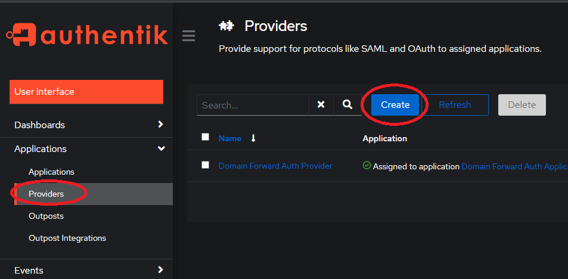  

2.  Proxy Provider
      

    a.  Name: `whoami-test individual auth`  
    b.  Select: `Forward auth (single application)`  
        **Single Application is where we change it up!*  
    c.  External Host: `https://whoami-test.domain.tld`  

    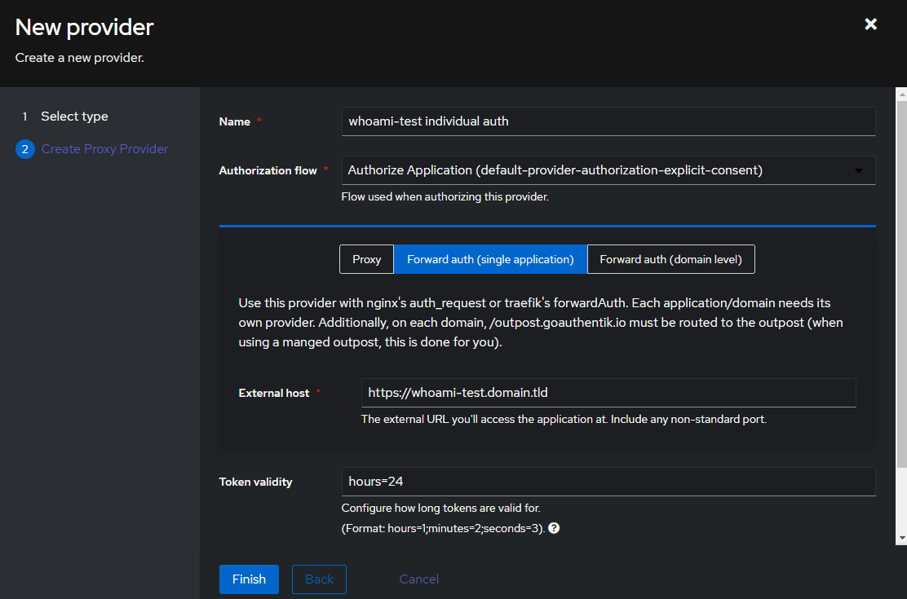  

    After hitting Finish it will show that it's not bound to an Application:  
    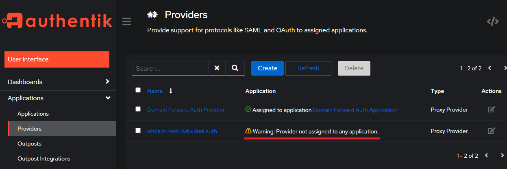  


#### Application Creation (individual application)  
1.  In the Admin Interface, go to Applications -> Applications -> Create   
    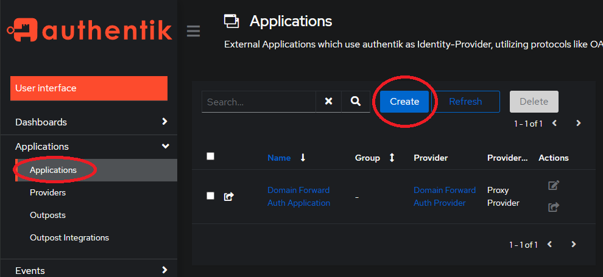  

    a.  Name: `whoami-test individual application`  
        _This is what appears on the Authentik user interface/dashboard_  
    b.  Slug: `whoami-test-forward-auth-application`  
        _An internal application name, name isn't super important_  
    c.  Provider: `whoami-test individual auth`  
        _This should match the previously created provider_  
    d.  Launch URL: `https://whoami-test.domain.tld`  
        _Do NOT put anything in the Launch URL, it needs to autodetect since it's the catch all rule_  
    e.  UI Settings (additional) - Up to you to decide on any of the remaining optional items.  

    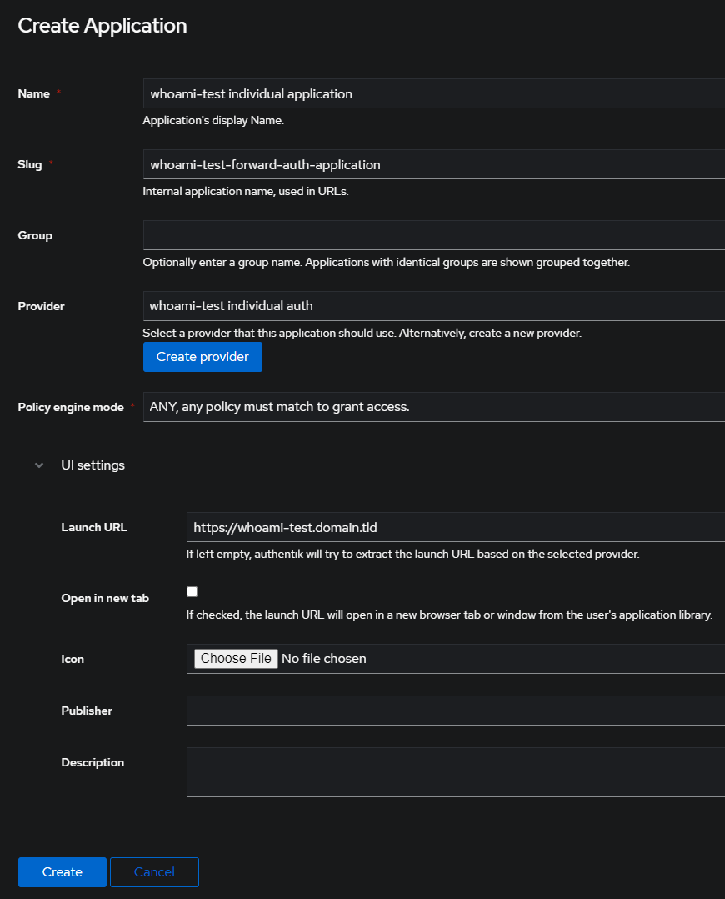  

    After hitting Create it will show that it is now bound to the previously created provider:  
    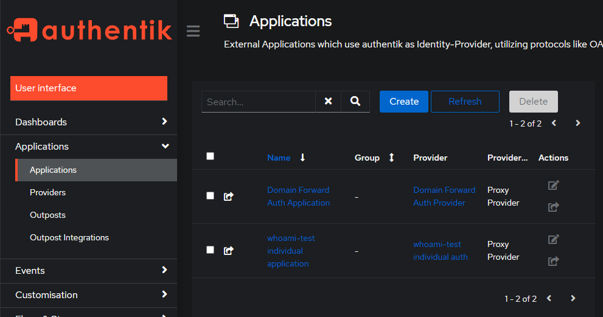  


#### Embedded Outpost (individual application)  
1.  In the Admin Interface, go to Applications -> Outposts
2.  Edit the existing embedded outpost by clicking Edit under Actions  
   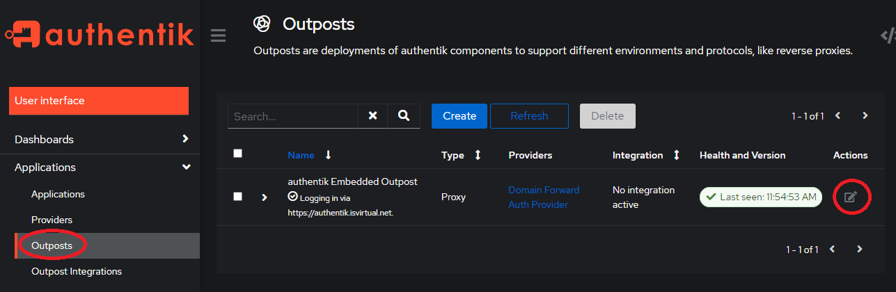  

3.  **Highlight** any application you want the outpost to be able to provide for.  In this case **Highlight** `Domain Forward Auth Application`  

    ***BEFORE HIGHLIGHT***  
    Notice that BEFORE highlighting, it still has only the domain wide (catch all) forwardAuth highlighted:
    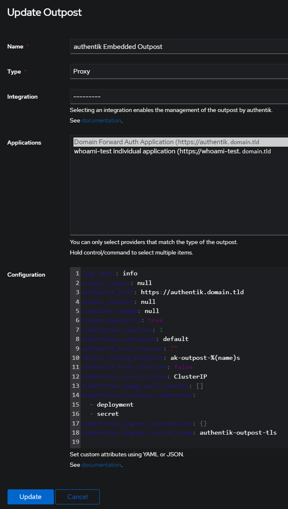  

    ***AFTER HIGHLIGHT***  
    This will include both the domain wide (catch all) and the individual application bound to this outpost.  
    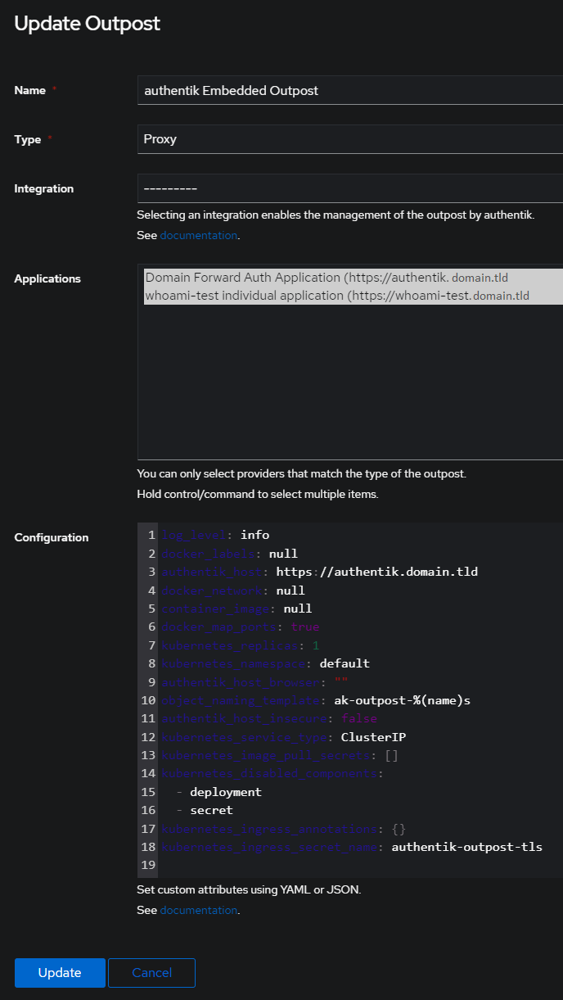  

    After hitting Update the Outpost page will show that the embedded outpost now has a provider bound to it:  
    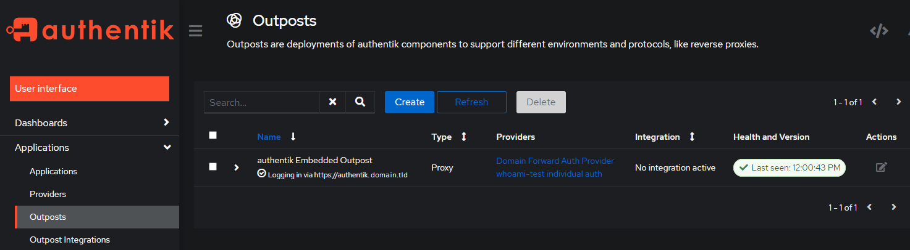  

#### Traefik Individual Application (Test / Validation)  
In order for Traefik to apply forwardAuth and require authentication to access a resource, you must tell Traefik that by adding a Middleware.  

In the above `docker-compose.yml` I have a whoami container for testing.  This container gives you a ton of important information for troubleshooting and debugging.  

```yaml
      ## Middlewares
      - "traefik.http.routers.whoami-test-rtr.middlewares=middlewares-authentik@file"
```

`middlewares-authentik@file` is what was defined at the top of this document in `middlewares.yml`.  

For each container you want protected, ensure you update/add the http router piece of Traefik's label, specifically `whoami-test-rtr` in the example shown above.  

Once this label is added to the container, recreate it.  
```bash
# Example using the whoami-test container  
docker-compose up -d -force-recreate whoami-test  
```

???+ warning "Incognito Browser"  
    Because authentik uses cookies, I recommend using Incognito for each piece of testing, so you don't have to clear cookies every time or when something is setup incorrectly.  
    
    **While using a container behind Authentik, it prompts for authentication, and then flashes but doesn't load.  This generally indicates cookies are messing up  the loading.  So use INCOGNITO**.

Next, navigate to `https://whoami-test.domain.tld`.  You should hit the authentication splash page due to Traefik's middleware.  Notice that the text below gives you a little bit of information that it is being caught by the Individual Application rule **whoami-test individual application**:      
  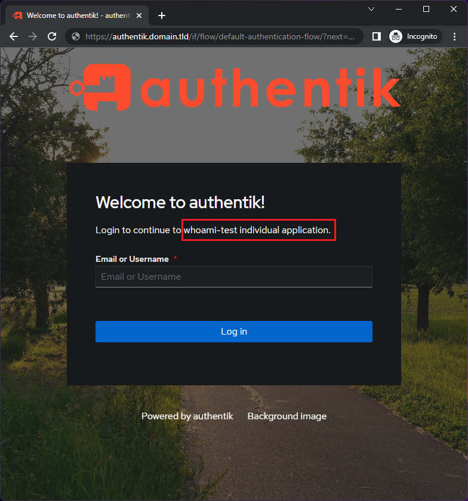  

Sign in with your username or email address initially created.  After inputting username & password, it should show you the "Redirecting" screen prior to actual redirection:  
  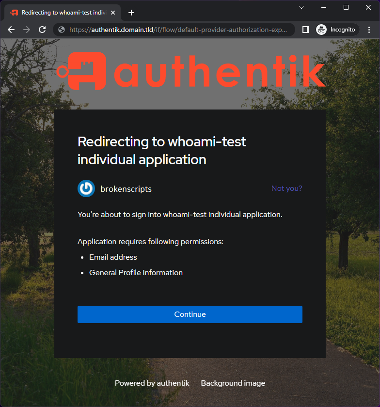  

After the redirect, look at the whoami information.  Notice it even reflects the application specific forwardAuth and that it is using the embedded outpost!  
    

The `X-Authentik-Meta-App` will contain information about the specific Application used to get here.  Notice that this matches the `slug` previously created.  
```html
X-Authentik-Meta-App: whoami-test-forward-auth-application  
```

## New User creation (optional)    

Inside the Admin Interface do the following steps to create an additional user:  

1.  Directory -> Users -> Create  
    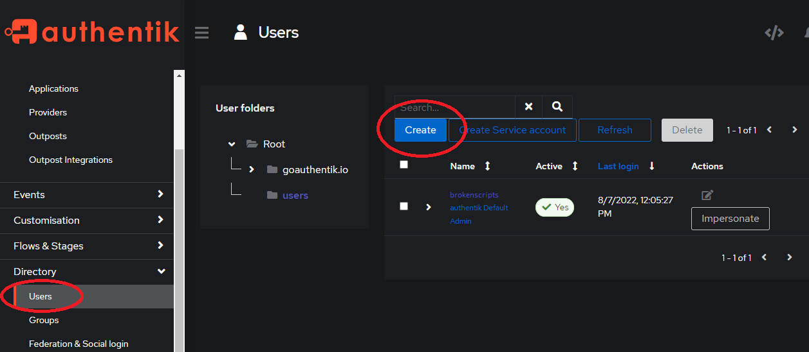  

2.  Fill in the required information  

3.  To create an admin, click the `+` in the **Groups** field and add the user to the "Authentik Admins" group.  
    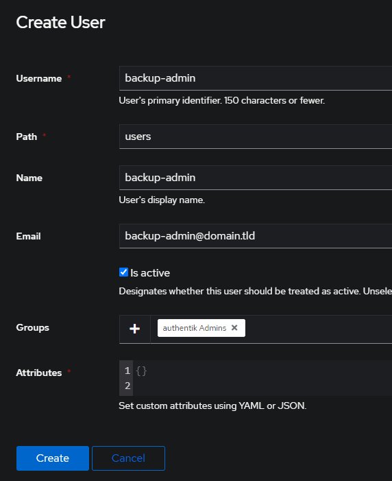  

4.  On the Users screen, click the down arrow beside the new user to view the `Set password` option:  
    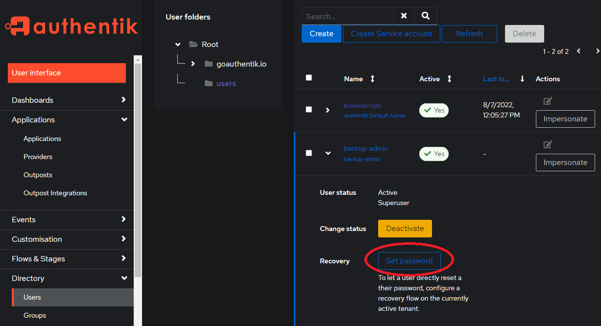  

5.  Logout of the current user, and login as the new user to ensure it can login and has administration privileges on the authentik WebUI.  


## Yubikey  

???+ warning "Backup Admin/Alternate Account"  
    To prevent locking yourself out and having to start over by deleting your postgres database, create a backup administrator or work on a non-administrator account.  

???+ info "Force MFA"  
    If you are unable to perform the below steps, skip to the **Force Authentication** section below  

If in the Admin Interface, go to the User Interface via the button at the top left of the screen.  
  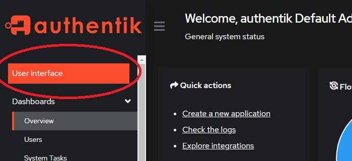  

Navigate to the MFA Devices screen.  

1.  Settings -> MFA Devices -> Enroll -> Security Key Authenticator  
    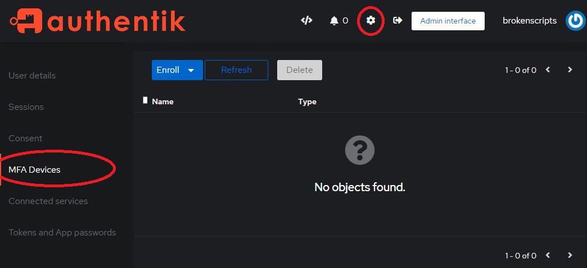  
    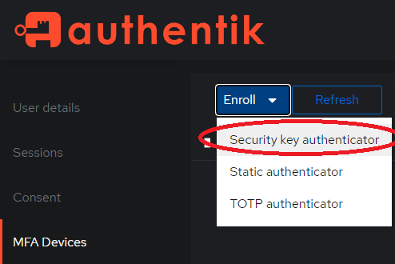  

2.  Complete WebAuthn setup  
    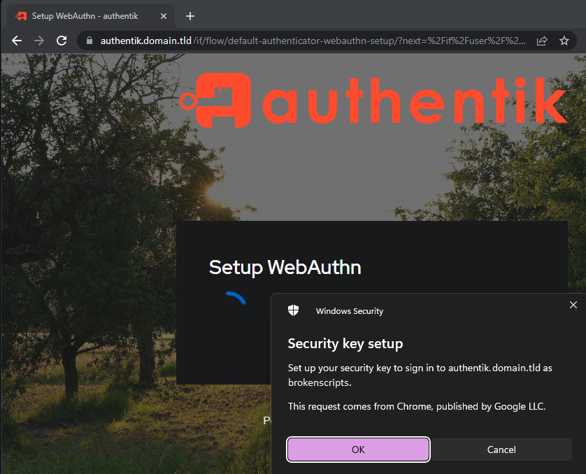  

???+ danger "Credential created on token"  
    By performing the setup like this, it asks to create a credential on the Yubikey device itself.  If you want to make it where it does NOT create the credential itself skip setup for now and go to the **WebAuthn Credential Creation** section where I will show how to change the save credential to key option.  After changing that option, you can revisit setup.  

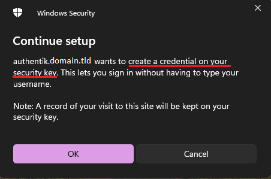  

During setup process, depending on your WebAuthn settings you might get prompted for a PIN:  
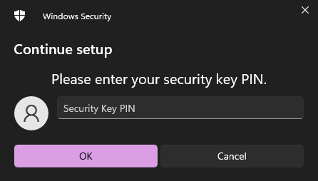  
If you are unsure about this, then review the following Yubikey documentation / explanation (https://support.yubico.com/hc/en-us/articles/4402836718866-Understanding-YubiKey-PINs)  
  > If you are being prompted for a PIN (including setting one up), and you're not sure which PIN it is, most likely it is your YubiKey's FIDO2 PIN.  

When the key is successfully registered to your user it will show in the MFA Devices screen:  
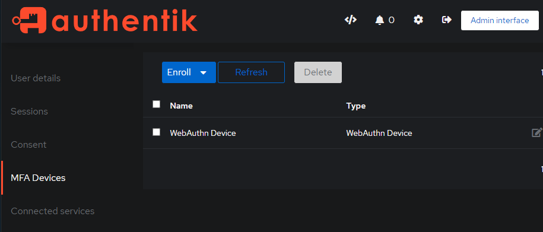  


### Force Authentication  
To configure an authentication a user must be in the state that forces them to add an authentication.  In order to do this, I am going to modify the default flow for authentication regarding MFA devices.  

1.  Go to the Admin Interface  
2.  Expand the left menu -> Flows & Stages -> Stages  
    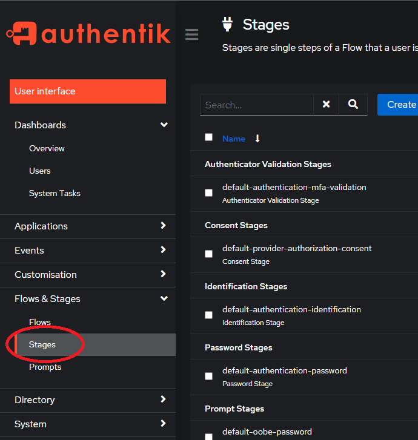  
3.  Edit the `default-authentication-mfa-validation` stage  
    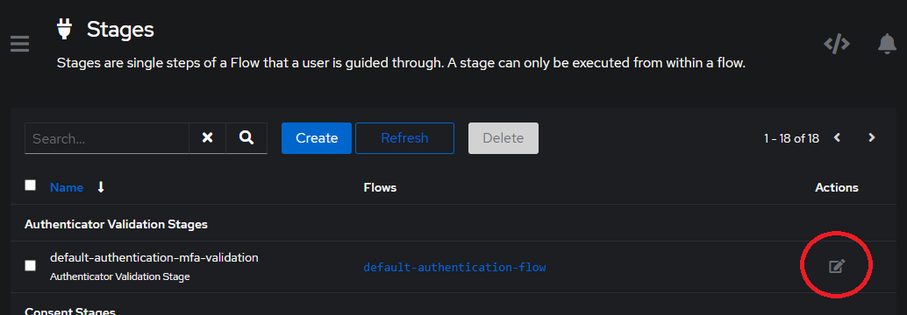  

    The initial settings for the `default-authentication-mfa-validation` stage look like this:  
    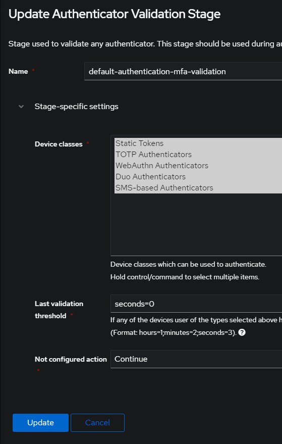  

4.  Change the Device Classes to what options you want you or other users to have (by default).  I am only going to **REMOVE** static tokens.  
    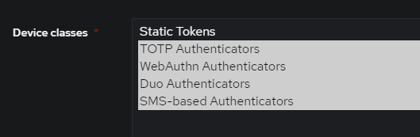  

5.  Update the `Not configured action` to "Force the user to configure an authenticator"  
    The default options are:
    * Continue  
    * Deny the user access  
    * Force the user to configure an authenticator  

6.  After setting the "Not configured action" to "Force the user to configure an authenticator" it will unlock the `Configuration stages` options.  
    * Select: `default-authenticator-totp-setup (TOP Authenticator Setup Stage)`  
    * Select: `default-authenticator-webauthn-setup (WebAuthn Authenticator Setup Stage)`  

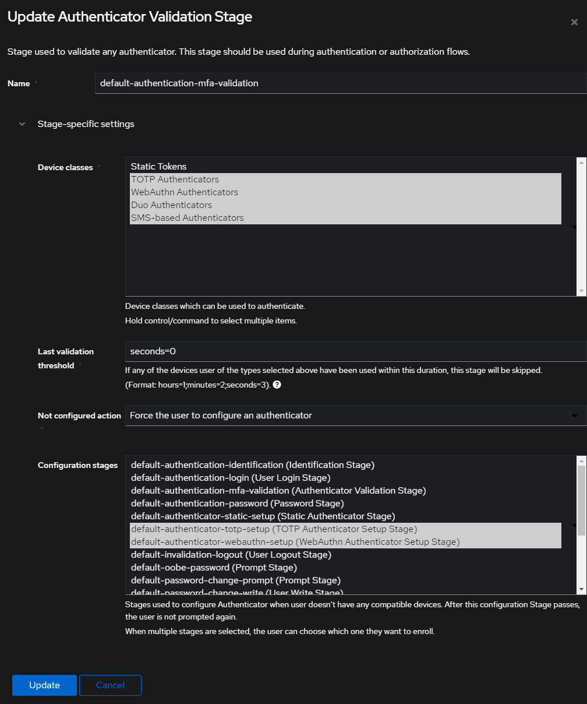  

Hit `Update`  

Open another **INCOGNITO** browser and navigate back to the whoami URL or authentik's URL and sign in.  

After entering the username/password a new window pop-up asks to select an authenticator method -- choose `default-authenticator-webauthn-setup`.  The following steps should match the **Yubikey** section above.  

### WebAuthn Credential Creation options (optional)  
In order to modify the default settings to prevent saving a credential on the Yubikey itself perform the following steps.  

1.  Go to the Admin Interface  
2.  Expand the left menu -> Flows & Stages -> Stages  
      

3.  Edit the `default-authenticator-webauthn-setup` stage  
    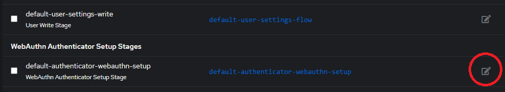  

    The default settings are:  
    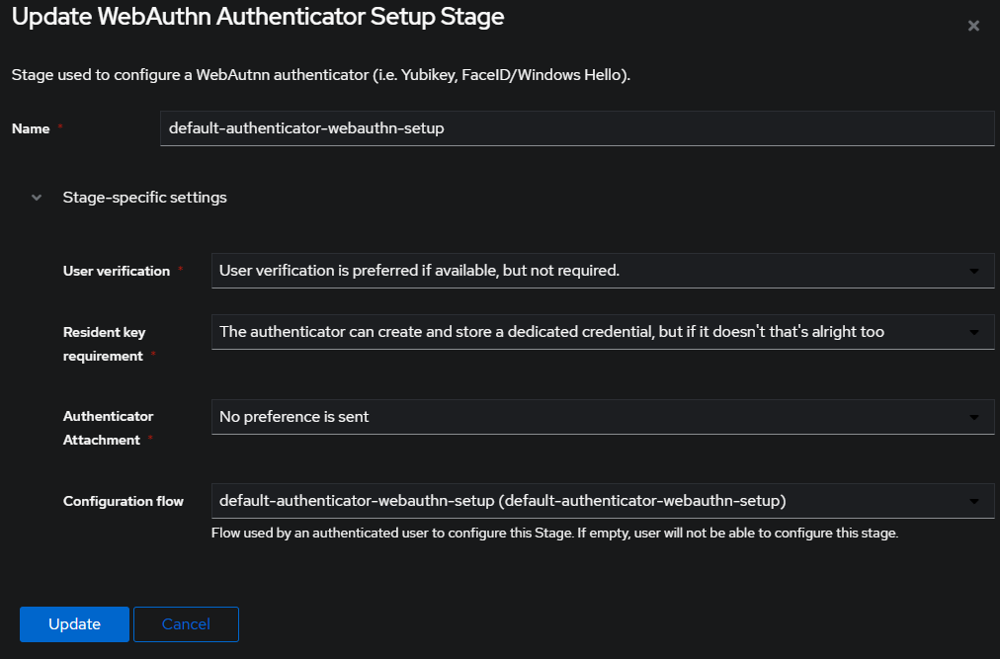  

4.  Edit `Resident key requirement`  
    * Default: The authenticator can create and store a dedicated credential, but if it doesn't thats alright too

    Unfortunately, if I try to skip the dedicated credential, I am unable to setup a Yubikey.  I am going to set this option to `The authenticator should not create a dedicated credential`.  

    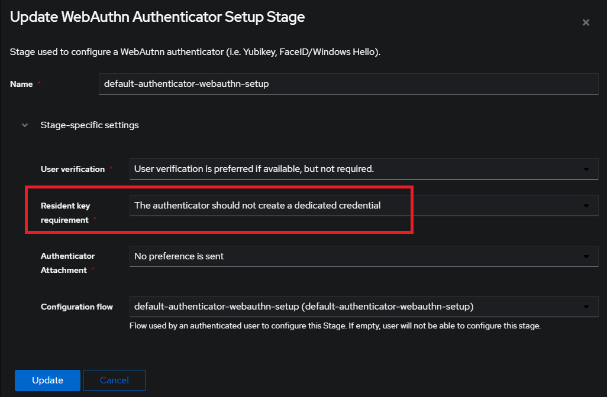  

5.  Optionally edit `User verification` depending on your WebAuthn expertise.  I am leaving it default (User verification is preferred if available, but not required).  

    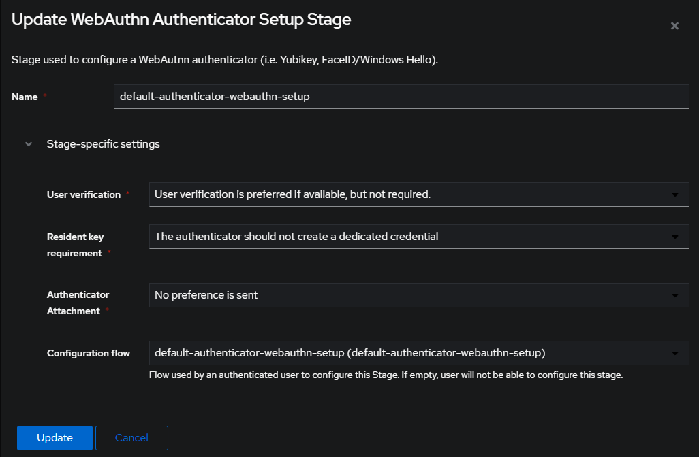  

6.  **Optional**, Authentik by default has no preference set for the Authenticator, as shown in the above picture.  This can be changed to be explicitly Yubikey OR Windows Hello/TouchID.  If you do not want to be prompted by Windows Hello, as shown in the **Windows Hello** section, then set this to `A "roaming" authenticator, like a YubiKey`.  
    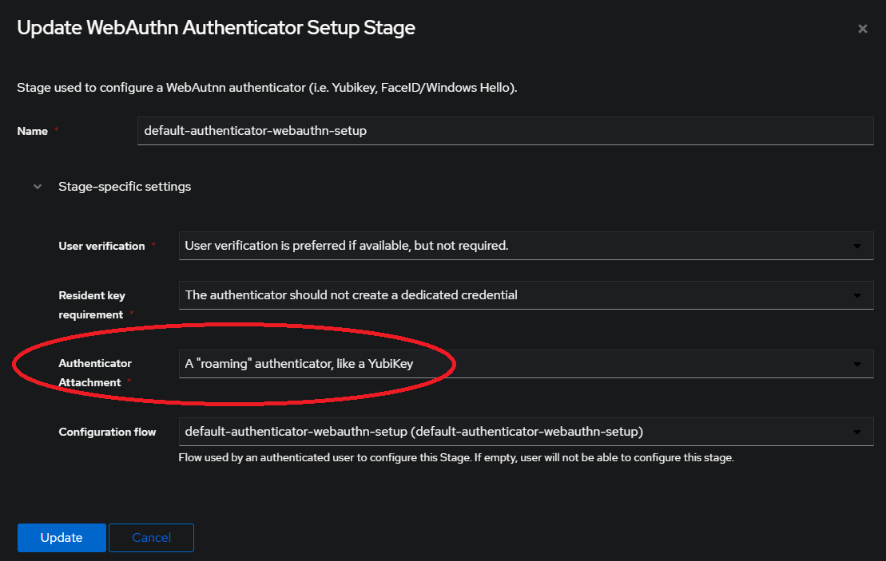  

7.  Revisit the Yubikey section and setup your key!  

### Windows Hello  
During Security Key enrollment, if you are interrupted by Windows Hello shown here:  
  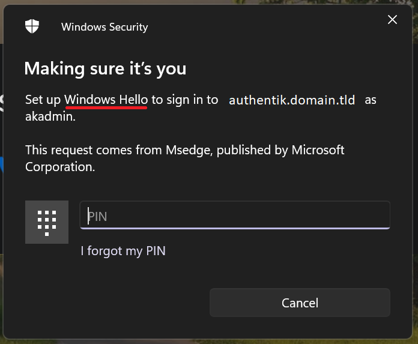  
Press `ESC` to continue to actual Yubikey enrollment.  This only seems to happen if you have previously setup Windows Hello.  If you are prompted for a PIN that you do not know, refer to the bottom of the **Yubikey** section for the Yubikey documentation link to address the PIN.  Optionally, you can also Force it to skip Windows Hello and go straight to the Yubikey by modifying the `default-authenticator-webauthn-setup`, as seen in the **WebAuthn Credential Creation options** section above.  

## Changing Domain Wide Policies  
The default domain (tenant) flows for all things using Authentik happen in this order:  
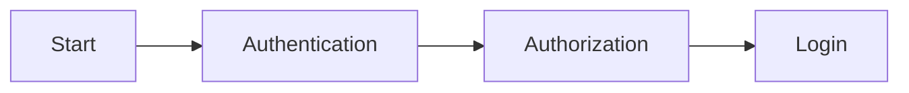
```mermaid
graph LR
  A[Start] --> B[Authentication];
  B --> C[Authorization];
  C --> D[Login];
```

### Authentication default  
By default the flow for all **authentication**, `default-authentication-flow`, is as follows:

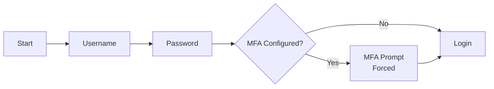
``` mermaid
graph LR
  A[Start] --> B[Username];
  B --> C[Password];
  C --> D{MFA Configured?};
  D -->|No| F[Login];
  D -->|Yes| E[MFA Prompt<br>Forced];
  E --> F;
```

### Authorization defaults  
There are two policies for **authorization**, explicit, `default-provider-authorization-explicit-consent`, and implicit, `default-provider-authorization-implicit-consent`.  By default the **explicit** policy is used.  
#### Explicit  
Explicit, `default-provider-authorization-explicit-consent`, requires a pop-up showing that you accept your information is about to be shared with the site.  This could be your email, username or whatever you have setup.  

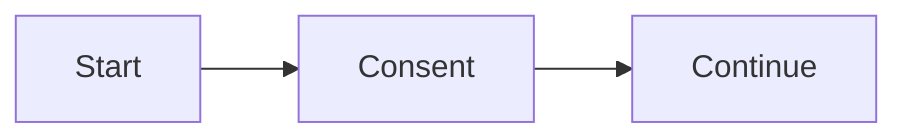
```mermaid
graph LR
  A[Start] --> B[Consent];
  B --> C[Continue];
```

#### Implicit  
Implicit, `default-provider-authorization-implicit-consent`, means that by logging in you accept your information (email or username, etc.) will be shared with the site, do not prompt, just continue through.  
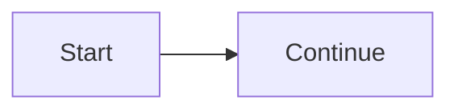
```mermaid
graph LR
  A[Start] --> B[Continue];
```

